# My React Lingo
  
Project for a platform similar to Duolingo using ReactJS/NextJS and Postgres SQL. The system allows payment for the Pro version using Stripe. 
There is an Admin interface for creating new courses, lessons, units, challenges, etc.

- [X] Version [English](README.md)
- [ ] Version [Portuguese](README_pt_br.md)
  
---
<br /><br />
<p align="center">
  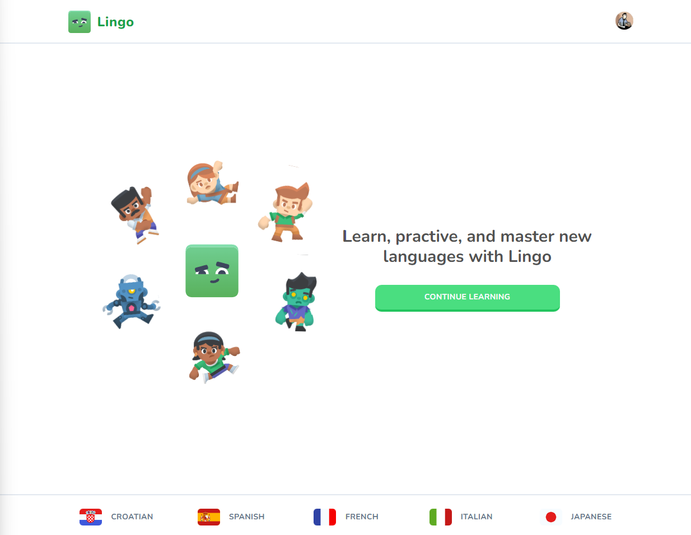
  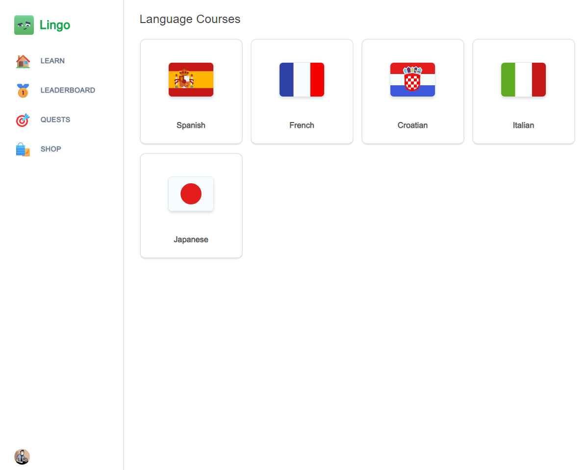 
</p>
<p align="center">
  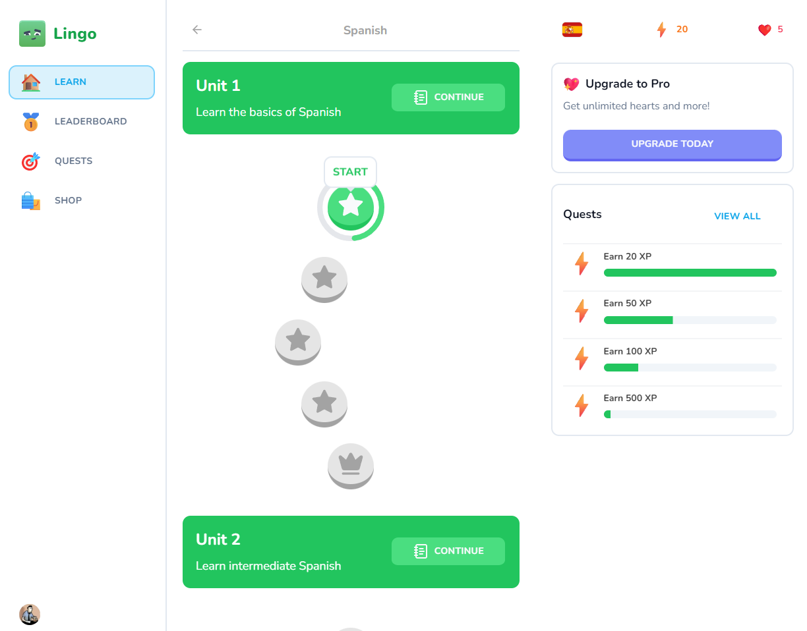
  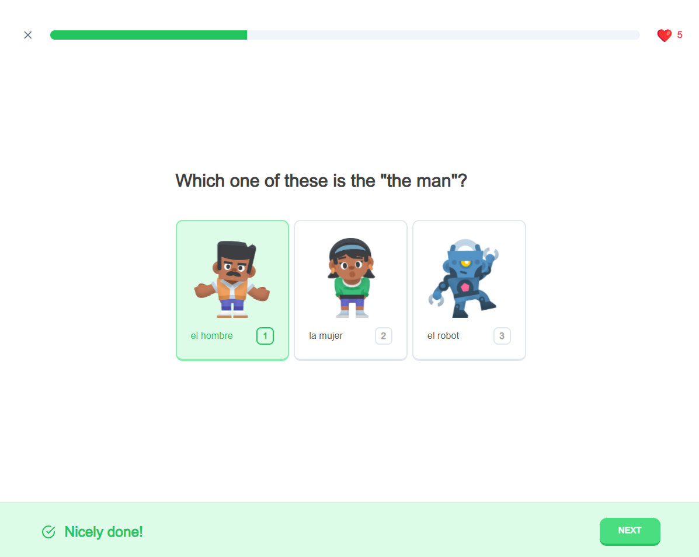 
</p>
<p align="center">
  
  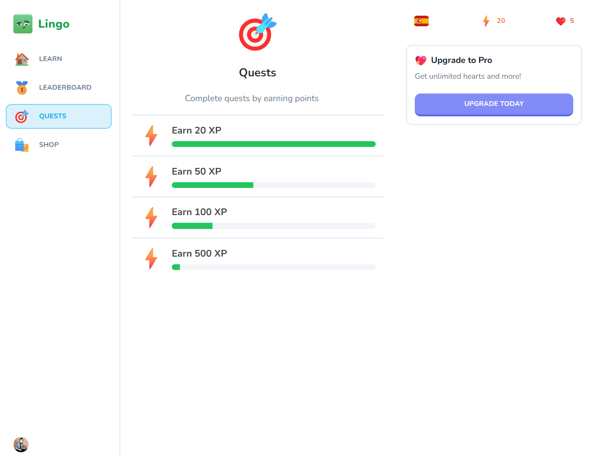 
</p>
<p align="center">
  
  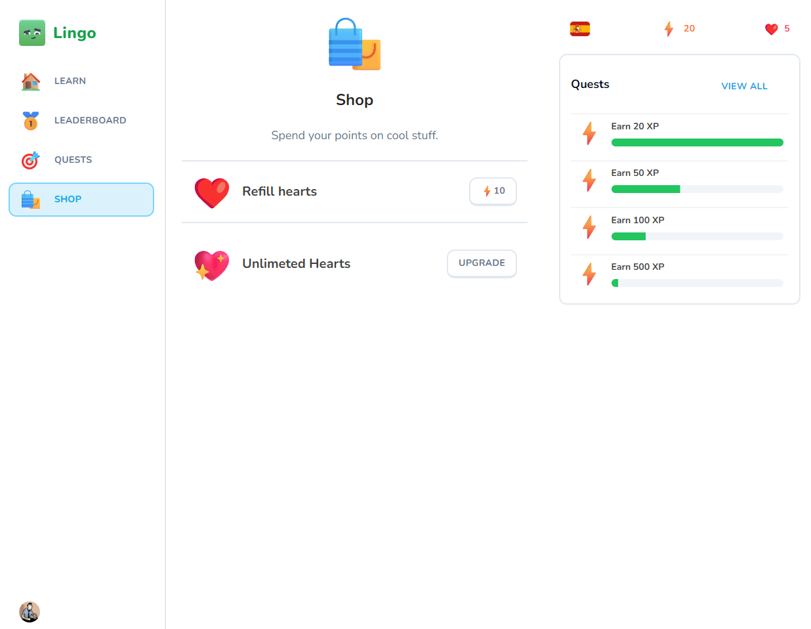 
</p>
<p align="center">
  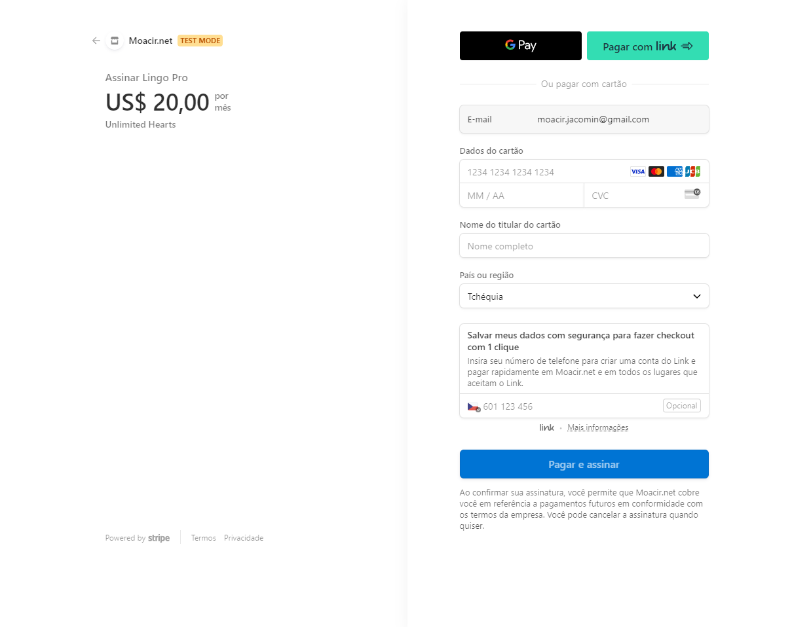
  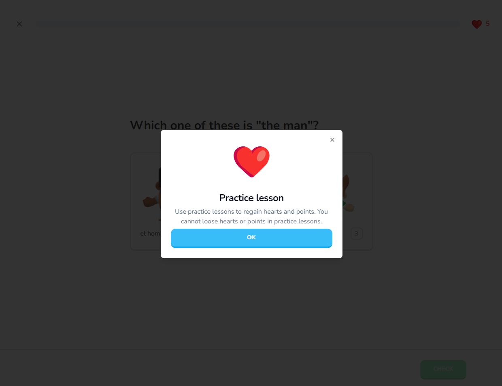 
</p>
<p align="center">
  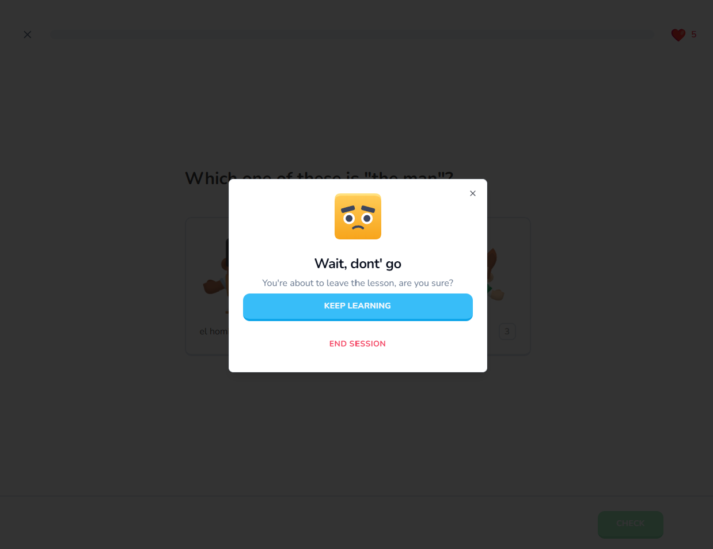
  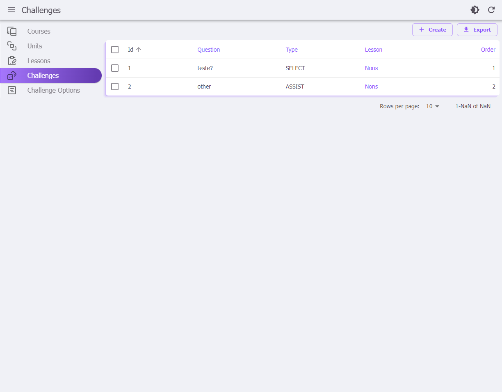 
</p>
<p align="center">
  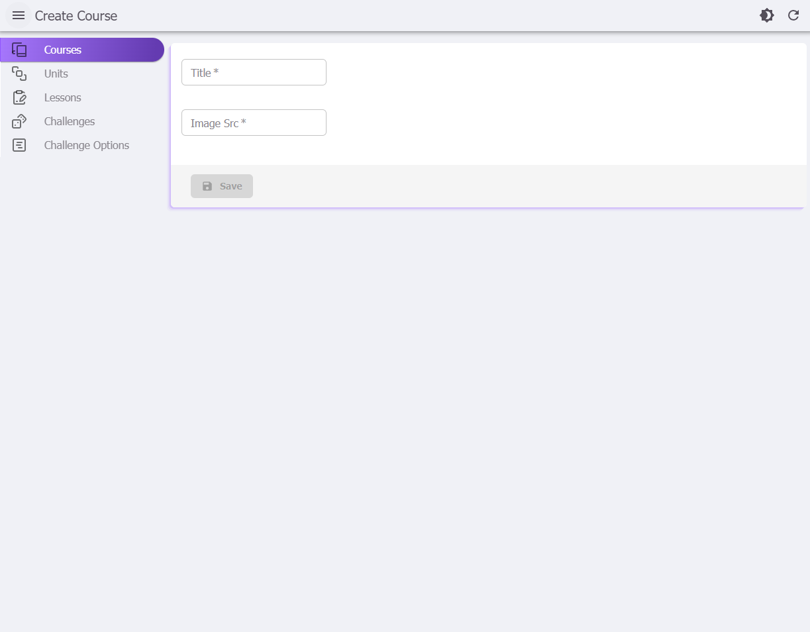
  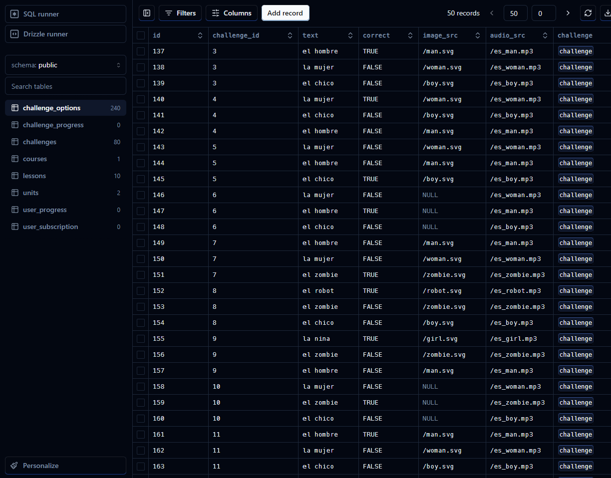 
</p>
---
<br /><br /><br />
 

## ✨ Purpose
To train the use of react, gamification concepts and at the same time test new technologies. <br>
---
<br /><br /><br />


## 🏁 Steps to install the project 
To run the application, execute the commands:: <br>

```console
npm install
npm run start
``` 
This will open the address [aa http://localhost:3000](http://localhost:3000) in your browser.<br><br>
---
<br /><br /><br />


### 🔑 What does this application do?
This application has been developed for study purposes and has the following functions:

- 🌐 Next.js 14 & server actions
- 🗣 AI Voices using Elevenlabs AI
- 🎨 Beautiful component system using Shadcn UI
- 🎭 Amazing characters thanks to KenneyNL
- 🔐 Auth using Clerk
- 🔊 Sound effects
- ❤️ Hearts system
- 🌟 Points / XP system
- 💔 No hearts left popup
- 🚪 Exit confirmation popup
- 🔄 Practice old lessons to regain hearts
- 🏆 Leaderboard
- 🗺 Quests milestones
- 🛍 Shop system to exchange points with hearts
- 💳 Pro tier for unlimited hearts using Stripe
- 🏠 Landing page
- 📊 Admin dashboard React Admin
- 🌧 ORM using DrizzleORM
- 💾 PostgresDB using NeonDB
- 🚀 Deployment on Vercel
- 📱 Mobile responsiveness
---
<br /><br /><br />

## ✔️ Topics covered  
 - NextJS  [next](https://nextjs.org/docs/getting-started/installation)
 - UI using Shadcn/ui [shadcn](https://ui.shadcn.com/)
 - Databse: Drizle ORM + postgress on Neon [drizzle](https://orm.drizzle.team/)
 - Payments with Stripe [Strip](https://stripe.com/)
---
<br /><br /><br />


## 🔗 Links 
Source of resources and documentation 
 - [Crips - ferramenta de chat no site](https://crisp.chat/en/livechat/)
 - [Clerk - Authentication](https://go.clerk.com/wmPbEeD)
 - [Kenney Assets](https://kenney.nl/)
 - [Freesound](https://freesound.org/)
 - [Elevenlabs AI](https://elevenlabs.io/)
 - [Flagpack](https://flagpack.xyz/)
 - [Neon for Postgres serveless](neon.tech)
 - [Drizzle ORM](https://orm.drizzle.team/docs/get-started-postgresql)
 - [Eleven AI - gerar audios](https://elevenlabs.io/)
---
<br /><br /><br />


## 🔑 Configuring environment variables
The system requires
- A Clerk account for user control [Clerk](https://clerk.com/)
- A Neon account to have a Postgres database [Neon](https://neon.tech/)
- A Stripe account to process payments [Stripe](https://stripe.com/)
```console
NEXT_PUBLIC_CLERK_PUBLISHABLE_KEY=
CLERK_SECRET_KEY=

DATABASE_URL=

STRIPE_API_KEY=

NEXT_PUBLIC_APP_URL="http://localhost:3000/"

STRIPE_WEBHOOK_SECRET=
```
Once the application has been published, you need to change the NEXT_PUBLIC_APP_URL variable and update Stripe's webhook settings to point to your new public Url.
---
<br /><br /><br />

## 🔒 How do you manage access/users? 
The access control part was done using a tool called [Clerk](https://clerk.com/)
- 1. create your account in the tool
- 2. create a project and access the 'API keys' menu option
- 3. copy your API key and update the configuration variable (file: .env) CLERK_SECRET_KEY
---
<br /><br /><br />

## 📡 How to test webhooks like Stripe's
You need to install the Stripe CLI locally to run tests without having to publish the site.
Stripe test card: 4242 4242 4242 4242 and anything in the other fields
-[Stripe - how to test webHooks](https://dashboard.stripe.com/test/webhooks/create?endpoint_location=local)
-[Installing the Stripe CLI](https://docs.stripe.com/stripe-cli)
```console
  // step 1:
  stripe login

  // step 2:
  stripe listen --forward-to localhost:3000/api/webhooks/stripe
```
---
<br /><br /><br />

## 🔒 How do I become an Admin? 
The admin interface is accessed via the /admin url, but to access it follow the steps below:
- 1. access your Clerk Admin panel to get your user code 
- 2. access the file \lib\admin-tools.ts and include your user id (looks like this: user_2oEgwocWTQa7e58gqBLKZfzFUw) in the allowedIds array
- 3. go to http://localhost:3000/admin to test
---
<br /><br /><br />
 
 
## 📒 Drizzle commands
Can be handy:
```console
    npx drizzle-kit studio
    npx drizzle-kit push:pg

    // atalhos do projeto
    npm run db:studio
    npm run db:push

    // seeds:
    npm run db:seed
    npm run db:reset
    npm run db:prod
``` 
---
<br /><br /><br />


## 👍🌟 Liked It?
If you liked it or found it useful, feel free to:
- Leave a star.
- Get in touch.
- Contribute with a pull request.
- Clone the repository.

---
<br /><br />

#
<footer>
  <p style="float:right; width: 30%;"> Copyright © Moacir Jacomin 
</p>