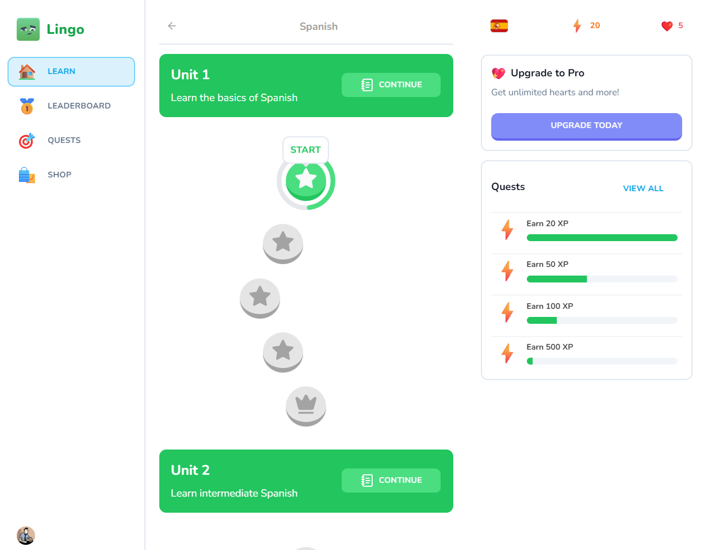
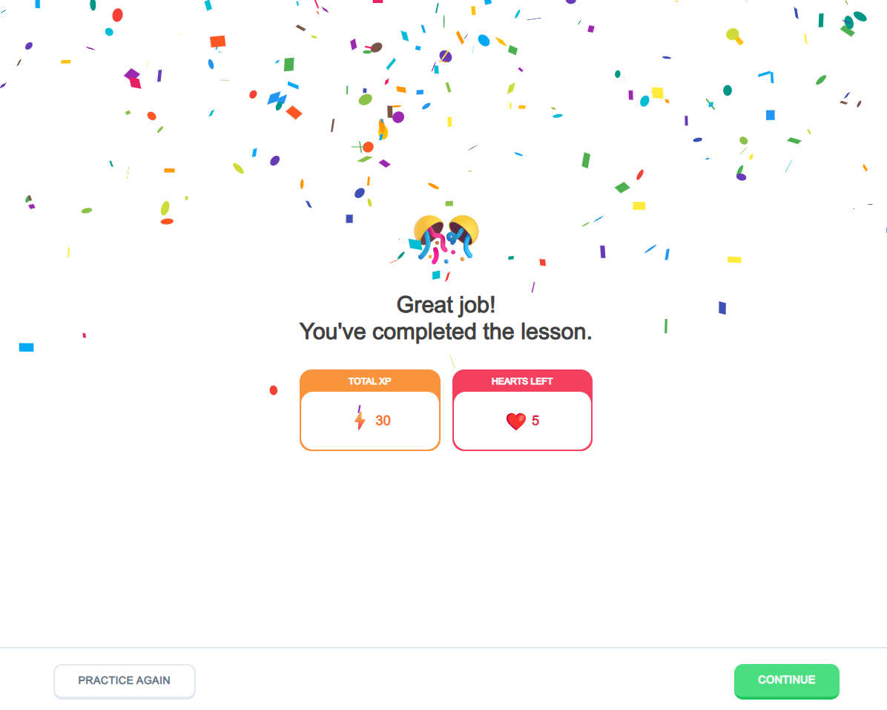
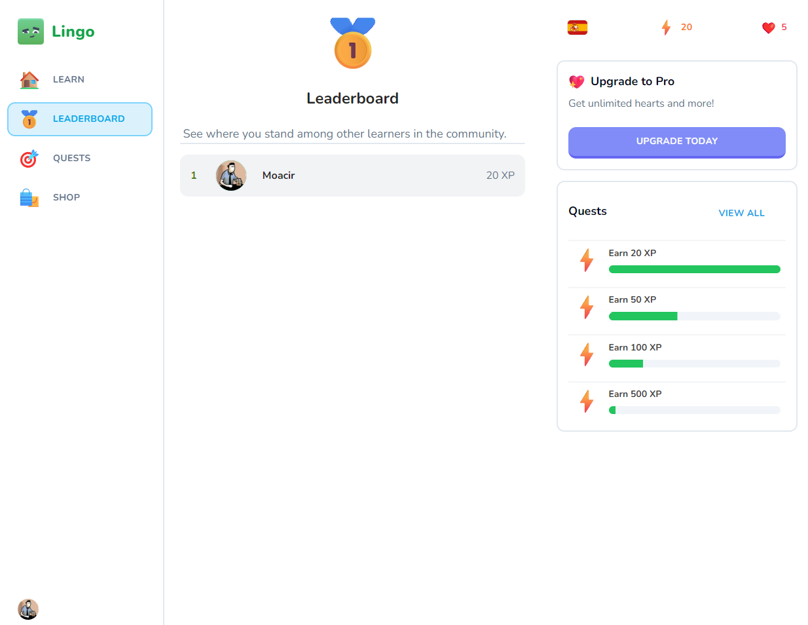
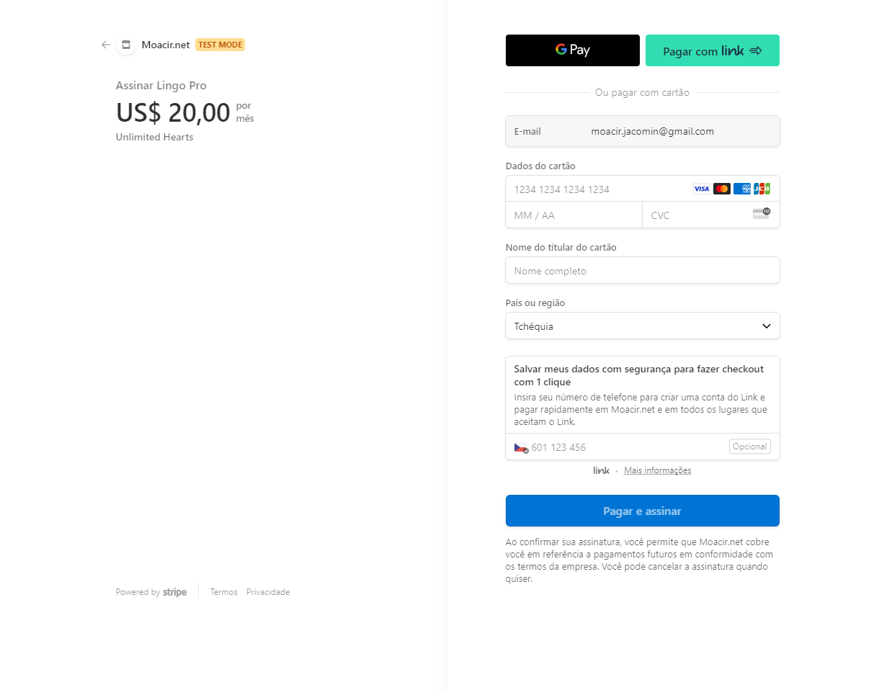
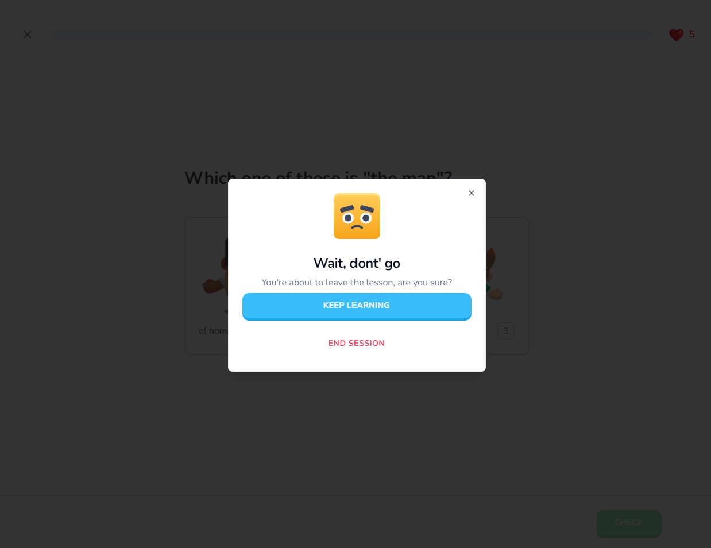
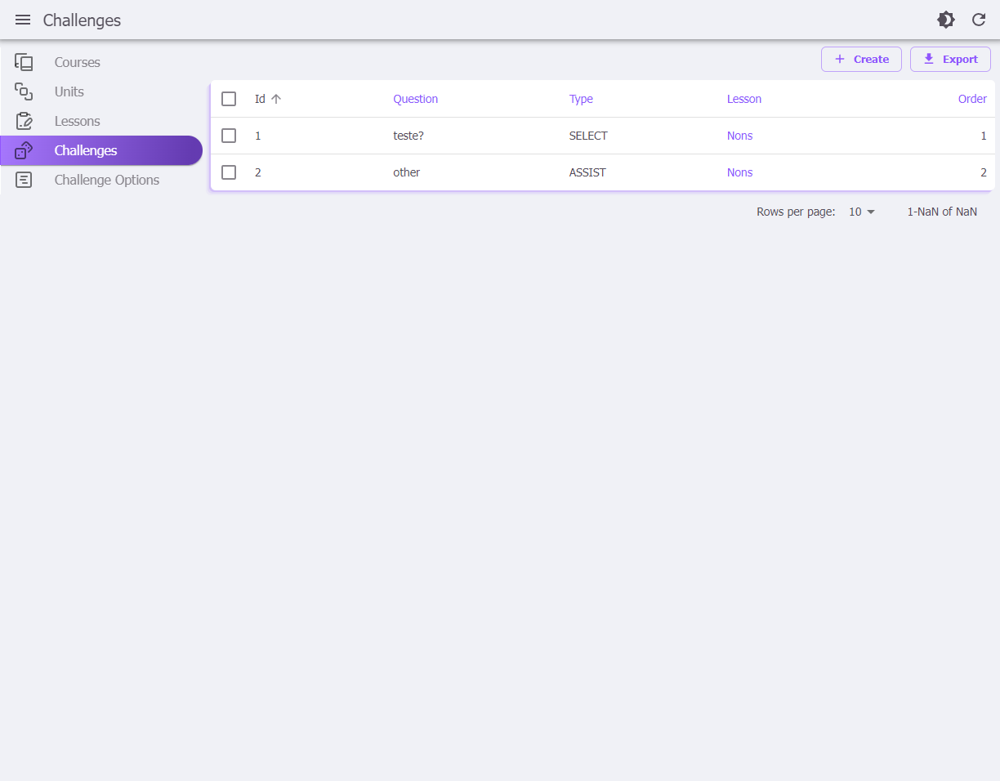
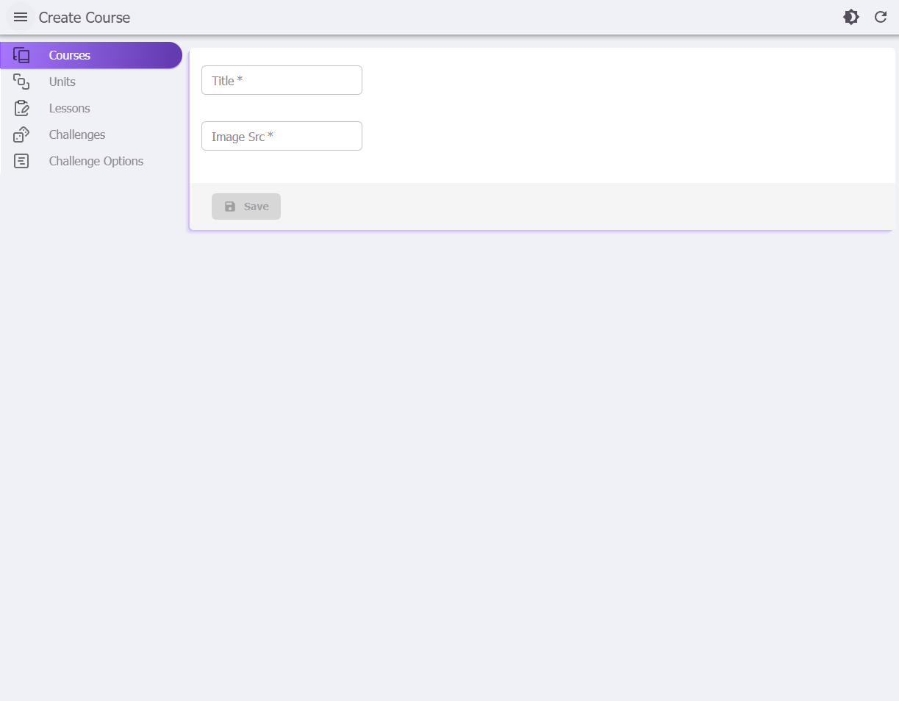

# My React Lingo
  
Projeto de uma plataforma semelhante ao Duolingo utilizando ReactJS/NextJS e Postgres SQL. O sistema permite pagamento da versao Pro utilizando Stripe. 
Ha uma interface Admin para a criacao de novos cursos, licoes, unidades, desafios. etc.

- [ ] Version [English](README.md)
- [X] Version [Portuguese](README_pt_br.md)
  
---
<br /><br />

<br />
<p align="center">
  
   
</p>
<p align="center">
  
   
</p>
<p align="center">
  
   
</p>
<p align="center">
  
   
</p>
<p align="center">
  
   
</p>
<p align="center">
  
   
</p>
<p align="center">
  
   
</p>
---
<br /><br /><br />

 
## ✨ Proposito
Treinar o uso do react, conceitos de gamificacao e ao mesmo tempo testar novas tecnologias. <br>
---
<br /><br /><br />
 

## 🏁 Passos para instalar o projeto 
Para rodar a aplicação, execute o comando: <br>

```console
npm install
npm run dev
``` 
Em seguida, será aberto o endereço [http://localhost:3000](http://localhost:3000) em seu navegador.<br><br>
---
<br /><br /><br />


## 🔑 O que faz essa aplicacão?
Esta aplicação foi desenvolvida com finalidade de estudos e possui as seguintes funcionalidades:

- 🌐 Next.js 14 & server actions
- 🗣 AI Voices using Elevenlabs AI
- 🎨 Beautiful component system using Shadcn UI
- 🎭 Amazing characters thanks to KenneyNL
- 🔐 Auth using Clerk
- 🔊 Sound effects using react-use
- ❤️ Hearts system
- 🌟 Points / XP system
- 💔 No hearts left popup
- 🚪 Exit confirmation popup
- 🔄 Practice old lessons to regain hearts
- 🏆 Leaderboard
- 🗺 Quests milestones
- 🛍 Shop system to exchange points with hearts
- 💳 Pro tier for unlimited hearts using Stripe
- 🏠 Landing page
- 📊 Admin dashboard React Admin
- 🌧 ORM using DrizzleORM
- 💾 PostgresDB using NeonDB
- 🚀 Deployment on Vercel
- 📱 Mobile responsiveness
---
<br /><br /><br />


## ✔️ Topicos abordados  
 - NextJS  [next](https://nextjs.org/docs/getting-started/installation)
 - UI using Shadcn/ui [shadcn](https://ui.shadcn.com/)
 - Database: Drizle ORM + postgress on Neon [drizzle](https://orm.drizzle.team/)
 - Pagamento com Stripe [Strip](https://stripe.com/)
---
<br /><br /><br />


## 🔗 Links 
Algo que pode ser util.  
 - [Crips - ferramenta de chat no site](https://crisp.chat/en/livechat/)
 - [Clerk - Authentication](https://go.clerk.com/wmPbEeD)
 - [Kenney Assets](https://kenney.nl/)
 - [Freesound](https://freesound.org/)
 - [Elevenlabs AI](https://elevenlabs.io/)
 - [Flagpack](https://flagpack.xyz/)
 - [Neon for Postgres serveless](neon.tech)
 - [Drizzle ORM](https://orm.drizzle.team/docs/get-started-postgresql)
 - [Eleven AI - gerar audios](https://elevenlabs.io/)
---
<br /><br /><br />


## 🔑 Configurando as variaveis de ambiente
Para funcionar o sistema exige:
- Uma conta no Clerk para controle de usuario [Clerk](https://clerk.com/)
- Uma conta no Neon para ter uma base de dados Postgres [Neon](https://neon.tech/)
- Uma conta no Stripe para processar pagamentos [Stripe](https://stripe.com/)
```console
NEXT_PUBLIC_CLERK_PUBLISHABLE_KEY=
CLERK_SECRET_KEY=

DATABASE_URL=

STRIPE_API_KEY=

NEXT_PUBLIC_APP_URL="http://localhost:3000/"

STRIPE_WEBHOOK_SECRET=
```
Apos a publicacao do aplicativo eh preciso trocar a variavel NEXT_PUBLIC_APP_URL e atualizar as configuracoes de webhook do Stripe para apontar para sua nova Url publica.
---
<br /><br /><br />


## 🔒 Como ocorre a gestao de acesso/usuarios? 
A parte de controle de acesso foi feita utilizando uma ferramenta chamada [Clerk](https://clerk.com/)
- 1. Crie sua conta na ferramenta
- 2. Crie um projeto e acesse a opcao do menu 'API keys'
- 3. Copie sua API key e atualize a variavel de configuracao (file: .env) CLERK_SECRET_KEY
---
<br /><br /><br />


## 📡 Como testar webhooks como o do Stripe
Eh preciso instalar o CLI do stripe localmente para efetuar testes sem ter que publicar o site.
Cartao de teste do Stripe: 4242 4242 4242 4242 e qualquer coisa nos outros campos
-[Stripe - como testar webHooks](https://dashboard.stripe.com/test/webhooks/create?endpoint_location=local)
-[Intalar a CLI Stripe](https://docs.stripe.com/stripe-cli)
```console
  // step 1:
  stripe login

  // step 2:
  stripe listen --forward-to localhost:3000/api/webhooks/stripe
```
---
<br /><br /><br />


## 🔒 Como me incluir como Admin? 
A interface admin eh acessada atravel da url /admin mas para ser possivel acessar siga os passos abaixo:
- 1. Acesse seu painel de Admin do Clerk para pegar o codigo do seu usuario 
- 2. Acesse o arquivo \lib\admin-tools.ts e inclua o id do seu usuario (se parece com isso: user_2oEgwocWTQa7e58gqBLKZfzFUw) no vetor allowedIds
- 3. Acesse http://localhost:3000/admin para testar
---
<br /><br /><br />
 

## 📒 Comandos do Drizzle
Pode ser util para lembrar 
```console
    npx drizzle-kit studio
    npx drizzle-kit push:pg

    // atalhos do projeto
    npm run db:studio
    npm run db:push

    // seeds:
    npm run db:seed
    npm run db:reset
    npm run db:prod
``` 
---
<br /><br /><br />


## 👍🌟 Gostou? 
Se gostou, se achou util, fique a vontade para: 
- Deixar uma estrela. 
- Entrar em contato.
- Contribuir com 'pull request'. 
- Clonar o repositorio.

---
<br /><br />

#
<footer>
  <p style="float:right; width: 30%;"> Copyright © Moacir Jacomin 
</p>